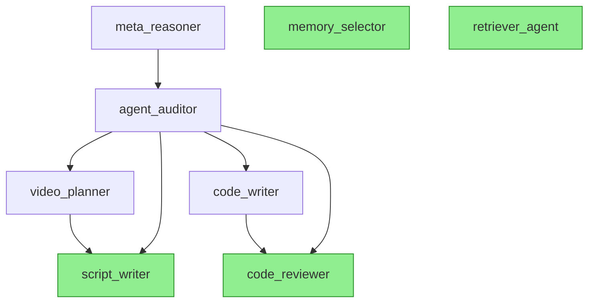

# CLAUDE.md - AI Ecosystem Platform Guide

**Last Updated:** 2025-11-27

> Comprehensive reference guide for AI assistants working on the AI Ecosystem codebase. This platform orchestrates intelligent agents with DNA-based evolution, telemetry-driven optimization, and multi-channel interaction.

---

## Table of Contents

1. [Project Overview & Quick Start](#1-project-overview--quick-start)
2. [Agent Architecture](#2-agent-architecture-critical)
3. [Agent Dependencies & Validation](#3-agent-dependencies--validation-critical)
4. [DNA Mutation System](#4-dna-mutation-system)
5. [Pipeline Execution](#5-pipeline-execution)
6. [Conversation Service](#6-conversation-service)
7. [Memory System (Mem0)](#7-memory-system-mem0)
8. [RAG (Retrieval) System](#8-rag-retrieval-system)
9. [Telemetry & Analytics](#9-telemetry--analytics)
10. [Security & Guardrails](#10-security--guardrails)
11. [Database Schema](#11-database-schema)
12. [Frontend Integration](#12-frontend-integration)
13. [Testing Strategy](#13-testing-strategy)
14. [Common Workflows](#14-common-workflows)
15. [Coding Conventions](#15-coding-conventions)
16. [Environment Configuration](#16-environment-configuration)
17. [Critical Gotchas & Warnings](#17-critical-gotchas--warnings)
18. [File Reference Guide](#18-file-reference-guide)
19. [Key Design Patterns](#19-key-design-patterns)
20. [Deployment Guide](#20-deployment-guide)

---

## 1. Project Overview & Quick Start

### What Is This?

Full-stack AI agent orchestration platform with DNA-based agent evolution, hot-reloadable configurations, pipeline orchestration, and telemetry-driven optimization.

### Tech Stack

- **Backend**: Python 3.11 + FastAPI + Uvicorn
- **Frontend**: React 19 + TypeScript 5.9 + Vite 7.2
- **Database**: Supabase (PostgreSQL 17)
- **AI Services**: Google Gemini API (LLM), Mem0 (memory), RAG (retrieval)
- **Integration**: Telegram Bot, REST API, Dashboard UI
- **Deployment**: Docker + Docker Compose

### Repository Structure

```
d:\ai-ecosystem/
├── backend/orchestrator/          # Python FastAPI backend
│   ├── main.py                    # App entry point
│   ├── agents/                    # Agent system (factory, specs, runner)
│   ├── api/                       # API routers (tasks, meta)
│   └── services/                  # Business logic (gemini, supabase, mem0, etc.)
├── frontend/                      # React + TypeScript + Vite
│   └── src/                       # Components and app
├── supabase/                      # Database migrations and config
│   ├── config.toml
│   └── migrations/                # 9 SQL migration files
├── scripts/                       # Utility scripts (data ingestion, validation)
├── tests/                         # Integration tests
├── docker-compose.yaml            # Container orchestration
├── .env                           # Environment configuration
└── CLAUDE.md                      # This file
```

### Quick Start

```bash
# 1. Set up environment variables
cp .env.example .env  # Edit with your API keys

# 2. Start services with Docker Compose
docker-compose up -d

# 3. Verify health
curl http://localhost:8000/health
# Expected: {"status": "ok"}

# 4. Check agent dependencies
curl http://localhost:8000/meta/dependencies/health
# Expected: {"is_healthy": true, "errors": [], ...}

# 5. Run frontend (separate terminal)
cd frontend
npm install
npm run dev
# Opens at http://localhost:5173
```

### Core Capabilities

- **Multi-Agent Orchestration**: code_writer, code_reviewer, video_planner, script_writer, agent_auditor, meta_reasoner, memory_selector, retriever_agent
- **DNA Evolution**: Agents evolve via telemetry-driven proposals with human approval
- **Hot Reload**: Configuration changes without service restart
- **Pipeline Execution**: Multi-agent workflows with dependency validation
- **Unified Conversation**: Single API handles Telegram, Dashboard, and direct API calls
- **Memory Management**: Long-term memory via Mem0 with semantic search and gating
- **RAG Integration**: Document retrieval for domain-specific knowledge
- **Telemetry Analytics**: Track success rates, confidence, failures, and DNA performance

---

## 2. Agent Architecture (CRITICAL)

### Agent Factory Pattern

Location: [backend/orchestrator/agents/agent_factory.py](backend/orchestrator/agents/agent_factory.py)

The agent factory provides centralized agent management with hot-reload capability:

```python
from orchestrator.agents.agent_factory import AgentFactory

# Get agent spec
spec = AgentFactory.get_agent("code_writer")
# Returns: {"role": "code_writer", "purpose": "...", "dna_rules": [...], "output_schema": {...}}

# Generate prompt for Gemini
prompt = AgentFactory.generate_prompt(input_data={"task": "..."}, role="code_writer")
# Combines DNA rules + output schema into structured prompt

# Hot reload after DNA mutation
AgentFactory.reload()
# Forces re-read from agent_specs.json without service restart

# List all agents
agents = AgentFactory.list_agents()
# Returns: ["code_writer", "code_reviewer", "video_planner", ...]
```

**How It Works:**
- Specs cached in memory on first use
- `reload()` forces fresh read from disk
- Prompt generation embeds DNA rules and JSON schema requirements
- All agents output strict JSON (no markdown, no prose)

### DNA Rules System

**Philosophy**: DNA rules are natural language constraints passed to the LLM. They define what the agent MUST do or MUST NOT do, enforced via prompt engineering.

**Structure**: Each agent in [agent_specs.json](backend/orchestrator/agents/agent_specs.json) has:

```json
{
  "code_writer": {
    "role": "code_writer",
    "purpose": "Generate production-ready code based on structured requirements. Output executable code with tests.",
    "dna_rules": [
      "output code ONLY in specified language — no mixed syntax",
      "every function must have docstring or comment explaining purpose",
      "include basic error handling — never assume happy path only",
      "output must include at least one test case",
      "no placeholder comments like 'TODO' or 'implement later'",
      "code must be complete and runnable — no stubs",
      "follow language-specific conventions (PEP8 for Python, etc.)",
      "output valid JSON with code in 'code' field — no raw code blocks"
    ],
    "output_schema": {
      "language": "string",
      "code": "string",
      "tests": "array",
      "dependencies": "array",
      "confidence": "float",
      "explanation": "string"
    }
  }
}
```

### Current Agent Registry

| Agent | Purpose | Dependencies | Terminal? |
|-------|---------|--------------|-----------|
| **code_writer** | Generate production code with tests | code_reviewer | No |
| **code_reviewer** | Review code for security, quality; gate deployment | None | Yes |
| **video_planner** | Extract structured context via questioning | script_writer | No |
| **script_writer** | Create timestamped reel scripts | None | Yes |
| **agent_auditor** | Analyze telemetry for failure patterns | All agents (read-only) | Yes |
| **meta_reasoner** | Propose DNA mutations based on audits | agent_auditor | Yes |
| **memory_selector** | Filter relevant memories to reduce noise | None | Yes |
| **retriever_agent** | Decide when external docs are needed | None | Yes |

**Dependency Graph** (Mermaid):


### Critical Warning

❌ **NEVER modify [agent_specs.json](backend/orchestrator/agents/agent_specs.json) directly**
✅ **ALWAYS use the DNA mutation workflow** (audit → propose → approve → apply)

Direct edits bypass:
- Dependency validation
- Dangerous pattern checks
- Versioning/rollback
- Telemetry tracking

**Exception**: During initial development or emergency hotfixes with manual testing.

---

## 3. Agent Dependencies & Validation (CRITICAL)

Location: [backend/orchestrator/services/agent_dependencies.py](backend/orchestrator/services/agent_dependencies.py)

### Dependency Map

The canonical dependency map defines which agents can invoke which agents:

```python
AGENT_DEPENDENCIES: Dict[str, List[str]] = {
    # Content pipeline
    "video_planner": ["script_writer"],
    "script_writer": [],

    # Code pipeline
    "code_writer": ["code_reviewer"],
    "code_reviewer": [],

    # Meta layer (can observe all agents)
    "agent_auditor": ["video_planner", "script_writer", "code_writer", "code_reviewer"],
    "meta_reasoner": ["agent_auditor"],
}
```

### Three Validation Rules

1. **No Circular Dependencies**: Agent A → B → C → A is forbidden
2. **No Phantom Dependencies**: All referenced agents must exist in agent_specs.json
3. **No Orphan Agents**: All agents in agent_specs.json must have dependency entries

### Health Check

```python
from orchestrator.services.agent_dependencies import run_dependency_health_check, validate_agent_can_call

# Run full health check
health = run_dependency_health_check()
# Returns: {
#   "is_healthy": true,
#   "errors": [],
#   "registered_agents": ["code_writer", "code_reviewer", ...],
#   "supported_agents": ["code_writer", "code_reviewer", ...]
# }

# Validate specific handoff
can_call = validate_agent_can_call("code_writer", "code_reviewer")
# Returns: True

can_call = validate_agent_can_call("code_reviewer", "code_writer")
# Returns: False (not in dependency map)
```

### API Endpoint

```bash
# Check system health before mutations or pipelines
curl http://localhost:8000/meta/dependencies/health

# Get Mermaid diagram
curl http://localhost:8000/meta/dependencies/mermaid

# Check if A can call B
curl "http://localhost:8000/meta/dependencies/can-call?caller=code_writer&callee=code_reviewer"
```

### When to Run Health Checks

✅ Before applying DNA mutations
✅ Before executing pipelines
✅ After adding new agents
✅ After modifying AGENT_DEPENDENCIES
❌ Not needed for read-only operations

---

## 4. DNA Mutation System

Location: [backend/orchestrator/services/dna_mutator.py](backend/orchestrator/services/dna_mutator.py)

### 8-Step Mutation Workflow

```
1. Telemetry Collection → 2. Agent Auditor Analyzes → 3. Meta Reasoner Proposes
         ↓
4. Human Approval Required → 5. Schema Validation → 6. Snapshot Current DNA
         ↓
7. Apply Mutation (File Lock) → 8. Hot Reload Agents
```

### Safety Guarantees

- **Pre/Post Validation**: Schema checks before and after mutation
- **Immutable Versioning**: Full agent_specs.json snapshot stored in `dna_versions` table
- **Cross-Platform File Locking**: Uses `fcntl` (Linux) or `msvcrt` (Windows)
- **Dangerous Pattern Blocking**: Rejects injection attempts, bypasses, overrides
- **Risk-Confidence Alignment**: High-risk changes require high confidence scores
- **Rollback Support**: Restore any prior version by ID

### Proposal Structure

```json
{
  "id": "uuid",
  "target_role": "code_writer",
  "change_type": "add_rule",  // Only "add_rule" or "remove_rule" supported
  "change_content": "Always include type hints for function parameters",
  "risk_level": "low",  // low, medium, high, critical
  "confidence": 0.85,   // 0.0-1.0
  "rollback_strategy": "Remove the added rule from dna_rules array",
  "status": "approved",
  "reviewed_by": "admin@example.com",
  "based_on_audit": "audit-uuid-123"
}
```

### Risk-Confidence Requirements

| Risk Level | Minimum Confidence |
|------------|-------------------|
| Low | Any |
| Medium | Any |
| High | 0.75 |
| Critical | 0.90 |

### Dangerous Patterns (Auto-Rejected)

- `ignore all previous`
- `disregard all instructions`
- `you are now`
- `pretend to be`
- `forget everything`
- `override rules`
- `bypass`
- `<script` (XSS)
- `eval(` or `exec(` (code injection)

### API Workflow

```bash
# 1. Generate audit report (analyze last 7 days)
curl -X POST http://localhost:8000/meta/audit?days=7

# 2. Generate proposals based on audit
curl -X POST http://localhost:8000/meta/propose/{audit_id}

# 3. Review and approve proposal
curl -X POST http://localhost:8000/meta/proposals/{id}/review \
  -H "Content-Type: application/json" \
  -d '{"action": "approve", "reviewed_by": "admin@example.com"}'

# 4. Apply approved proposal
curl -X POST http://localhost:8000/meta/proposals/{id}/apply \
  -H "X-Admin-Key: your-admin-key"

# 5. Verify hot reload
curl http://localhost:8000/meta/dependencies/health

# Rollback if needed
curl -X POST http://localhost:8000/meta/rollback/{version_id} \
  -H "X-Admin-Key: your-admin-key"
```

### Critical Warning

❌ **NEVER skip human approval** - meta_reasoner cannot apply mutations
❌ **NEVER use change_type: "modify_rule"** - only add_rule and remove_rule supported
✅ **ALWAYS test after mutation** - run health check and agent execution
✅ **ALWAYS create rollback strategy** - required field in proposals

---

## 5. Pipeline Execution

Location: [backend/orchestrator/services/pipeline_executor.py](backend/orchestrator/services/pipeline_executor.py)

### Pipeline Flow

```
1. Validate Pipeline Structure (dependency check)
     ↓
2. Execute Agents Sequentially
     ↓
3. Transform Outputs for Handoffs
     ↓
4. Record Telemetry Per Step
     ↓
5. Halt on Errors or REJECT Verdicts
```

### Predefined Pipelines

```python
{
  "code_generation": ["code_writer", "code_reviewer"],
  "video_content": ["video_planner", "script_writer"]
}
```

### Handoff Transformations

Example: code_writer → code_reviewer

```python
def _prepare_handoff(output: dict) -> dict:
    """Transform previous agent output for next agent input."""
    if current_agent == "code_writer":
        return {
            "code_to_review": output["code"],
            "language": output["language"],
            "tests": output.get("tests", [])
        }
    # ... other transformations
```

### API Endpoints

```bash
# Validate pipeline structure before execution
curl -X POST http://localhost:8000/meta/pipeline/validate \
  -H "Content-Type: application/json" \
  -d '{"steps": ["code_writer", "code_reviewer"]}'

# Execute custom pipeline
curl -X POST http://localhost:8000/meta/pipeline/execute \
  -H "Content-Type: application/json" \
  -d '{
    "steps": ["code_writer", "code_reviewer"],
    "initial_input": {"task": "Create a function to calculate fibonacci"}
  }'

# Run predefined pipeline template
curl -X POST http://localhost:8000/meta/pipeline/run/code_generation \
  -H "Content-Type: application/json" \
  -d '{"task": "Create authentication middleware"}'

# List available templates
curl http://localhost:8000/meta/pipeline/templates
```

### Halting Conditions

Pipeline execution stops immediately if:
1. Agent returns `status: "error"`
2. code_reviewer returns `verdict: "REJECT"`
3. Agent confidence < 0.6 and reviewer not yet run
4. Dependency validation fails mid-pipeline

### Critical Warning

❌ **NEVER execute unvalidated pipelines** - always call `/validate` first
❌ **NEVER ignore REJECT verdicts** - treat as final decision
✅ **ALWAYS handle errors gracefully** - record telemetry even on failure
✅ **ALWAYS log trace_id** - enables end-to-end traceability

---

## 6. Conversation Service

Location: [backend/orchestrator/services/conversation_service.py](backend/orchestrator/services/conversation_service.py)

### Unified Architecture Flow

```
User Message → Guardrails → Rate Limit → Intent Detection → Memory Search
     ↓
Memory Selector → RAG Decision → RAG Search → Agent Handler
     ↓
Response Generation → Telemetry Recording → UI Elements → Return
```

### Intent Detection

Regex patterns match user messages to intents:

```python
class Intent(str, Enum):
    GENERATE_CODE = "generate_code"
    GENERATE_VIDEO = "generate_video"
    REVIEW_CODE = "review_code"
    DEPLOY = "deploy"
    CHECK_STATUS = "check_status"
    LIST_TASKS = "list_tasks"
    CLARIFY = "clarify"
    UNKNOWN = "unknown"

INTENT_PATTERNS = {
    Intent.GENERATE_CODE: [
        r"(create|generate|write|build|make).*(code|function|endpoint|api)",
        r"(python|javascript|typescript|go).*(function|code|script)",
    ],
    Intent.DEPLOY: [
        r"(deploy|ship|release|push)",
        r"^deploy\s*(it|this|that|now)?$",
    ],
    # ...
}
```

### Response Structure

```python
{
  "reply": "I'll create that function for you.",
  "action": "await_confirmation",  # complete | clarify | blocked
  "intent": "generate_code",
  "trace_id": "uuid-for-telemetry",
  "ui_elements": [
    {"type": "button", "label": "Deploy", "payload": {"action": "deploy"}},
    {"type": "code_block", "content": "def hello():\n    pass"}
  ],
  "data": {"confidence": 0.87, "agent": "code_writer"},
  "next_context": {"task_id": "123", "state": "awaiting_review"}
}
```

### Universal Entry Point

```bash
# POST /meta/converse - handles ALL mediums
curl -X POST http://localhost:8000/meta/converse \
  -H "Content-Type: application/json" \
  -d '{
    "message": "Create a Python function to validate email addresses",
    "medium": "api",
    "user_id": "user-123",
    "context": {"previous_task_id": "task-456"}
  }'

# Response includes UI-agnostic elements
# Telegram renders as buttons
# Dashboard renders as React components
# API returns raw structure
```

### Medium-Specific Handling

```python
class Medium(str, Enum):
    TELEGRAM = "telegram"
    DASHBOARD = "dashboard"
    API = "api"

# Telegram: Inline keyboards for ui_elements
# Dashboard: React components from ui_elements
# API: Raw JSON response
```

### Critical Warning

❌ **NEVER skip guardrails** - RequestGuard runs before intent detection
❌ **NEVER ignore rate limits** - prevent abuse via user_preferences table
✅ **ALWAYS log trace_id** - enables conversation debugging
✅ **ALWAYS return next_context** - maintains session state

---

## 7. Memory System (Mem0)

Location: [backend/orchestrator/services/mem0_tool.py](backend/orchestrator/services/mem0_tool.py)

### Hybrid Architecture

- **Vector Store**: Semantic similarity search
- **Graph Store**: Entity relationships and connections
- **Scoping**: user_id, agent_id, session_id tags

### Memory Gating Pattern (CRITICAL)

```python
from orchestrator.services.mem0_tool import search_memory, select_memories

# 1. Search raw memories (vector + graph)
raw_memories = search_memory(
    query="user preferences for code style",
    user_id="user-123",
    limit=5
)
# Returns: [{"memory": "User prefers PEP8", "relevance": 0.92}, ...]

# 2. Filter through memory_selector agent
selection = select_memories(
    query="Generate Python code",
    raw_memories=raw_memories,
    user_id="user-123"
)
# Returns: {
#   "approved_memories": [{"memory": "...", "reason": "Directly relevant"}],
#   "rejected_memories": [{"memory": "...", "reason": "Noise"}],
#   "confidence": 0.85
# }

# 3. Use ONLY approved memories
approved = selection["approved_memories"]

# 4. Inject with attribution
prompt += "\n\nRELEVANT MEMORIES:\n"
for mem in approved:
    prompt += f"- {mem['memory']} (source: memory)\n"
```

### Critical Convention

❌ **NEVER inject raw memories** - always filter through memory_selector
❌ **NEVER use memories without attribution** - agent must know source
✅ **ALWAYS check relevance threshold** - reject if < 0.6
✅ **ALWAYS record memory usage in telemetry** - track memory_used: true

### Memory Operations

```python
# Add memory
from orchestrator.services.mem0_tool import add_memory

add_memory(
    content="User prefers snake_case for Python variables",
    user_id="user-123",
    agent_id="code_writer",
    metadata={"category": "code_style"}
)

# Search with filters
memories = search_memory(
    query="code style preferences",
    user_id="user-123",
    agent_id="code_writer",
    limit=3
)
```

---

## 8. RAG (Retrieval) System

Location: [backend/orchestrator/services/retrieval_service.py](backend/orchestrator/services/retrieval_service.py)

### Two-Stage Process

```
1. retriever_agent Decides: "Does this request need external docs?"
     ↓ (if yes)
2. rag_search() Executes: Semantic search in document store
     ↓
3. Format Documents: Wrap with <doc> tags and source attribution
     ↓
4. Inject as EVIDENCE: Append to agent prompt
```

### Document Formatting

```markdown
## Retrieved Evidence (do NOT modify facts)

1) <doc source='API Documentation'>
   The authenticate() function requires a JWT token in the Authorization header.
   </doc>

2) <doc source='Security Policy'>
   All endpoints must validate CSRF tokens except /health and /metrics.
   </doc>
```

### Critical Convention

❌ **NEVER let agents modify facts** - documents are EVIDENCE, not instructions
❌ **NEVER skip retriever_agent** - prevents unnecessary retrieval overhead
✅ **ALWAYS attribute sources** - enables fact verification
✅ **ALWAYS record RAG usage in telemetry** - track rag_enabled: true, rag_source_count: 2

### API Usage

```bash
# Retrieval happens automatically in conversation service
curl -X POST http://localhost:8000/meta/converse \
  -H "Content-Type: application/json" \
  -d '{
    "message": "How do I authenticate with the API?",
    "medium": "api",
    "user_id": "user-123"
  }'

# Response includes rag_enabled: true in data
```

### When RAG Triggers

- Questions about domain-specific knowledge
- Requests mentioning products, policies, APIs
- Confidence < 0.6 for general knowledge response

---

## 9. Telemetry & Analytics

### Key Tables

| Table | Purpose |
|-------|---------|
| `task_telemetry` | Agent execution metrics (success, confidence, latency) |
| `conversation_feedback` | User feedback on conversation turns |
| `dna_versions` | Snapshots of agent_specs.json before mutations |
| `memory_telemetry` | Memory search and selection metrics |
| `rag_telemetry` | RAG retrieval performance and sources |

### Tracked Metrics

```python
{
  "task_id": "uuid",
  "agent_role": "code_writer",
  "success": true,
  "confidence_final": 0.87,
  "time_taken_seconds": 3,
  "failure_category": null,  # formatting | factual | logic | performance | timeout
  "human_feedback": "Code works perfectly",
  "human_override": false,
  "dna_version": "v20251127-153045",
  "memory_used": true,
  "memory_sources": ["pref-123", "context-456"],
  "rag_enabled": false,
  "rag_query": null,
  "rag_source_count": 0
}
```

### Analytics Endpoints

```bash
# Agent performance metrics
curl http://localhost:8000/meta/analytics/agents

# DNA version performance comparison
curl http://localhost:8000/meta/analytics/dna

# Failure breakdown by category
curl http://localhost:8000/meta/analytics/failures

# Intent success rates
curl http://localhost:8000/meta/analytics/success-rates

# Daily usage trends
curl http://localhost:8000/meta/analytics/daily-usage
```

### Recording Telemetry

```bash
curl -X POST http://localhost:8000/meta/telemetry \
  -H "Content-Type: application/json" \
  -d '{
    "task_id": "task-123",
    "agent_role": "code_writer",
    "success": true,
    "confidence_final": 0.89,
    "memory_used": true,
    "rag_enabled": false
  }'
```

---

## 10. Security & Guardrails

Location: [backend/orchestrator/services/guardrails.py](backend/orchestrator/services/guardrails.py)

### Content Safety Patterns

```python
from orchestrator.services.guardrails import RequestGuard

# Validate incoming message
guard = RequestGuard(message="User message here", user_id="user-123")

if not guard.is_safe:
    response = guard.get_blocked_response()
    # Returns: {"reply": "Message blocked due to...", "action": "blocked"}
```

**Blocked Patterns:**
- Profanity and NSFW content
- Violence and threats
- Illegal activity requests
- Self-harm content (redirects to crisis resources)

### Authentication

**Admin Key Protection:**

```python
from fastapi import Depends, Header, HTTPException

def require_admin_key(x_admin_key: str = Header(..., alias="X-Admin-Key")):
    """Dependency for protected endpoints."""
    if x_admin_key != os.getenv("META_ADMIN_KEY"):
        raise HTTPException(status_code=403, detail="Invalid admin key")
    return x_admin_key

# Usage
@router.post("/meta/proposals/{id}/apply")
def apply_proposal(id: str, _admin: str = Depends(require_admin_key)):
    # Only executes if valid admin key provided
    pass
```

**Protected Endpoints:**
- POST /meta/proposals/{id}/apply
- POST /meta/rollback/{version}
- POST /meta/actions/execute

### API Usage

```bash
# Protected endpoint requires X-Admin-Key header
curl -X POST http://localhost:8000/meta/proposals/{id}/apply \
  -H "X-Admin-Key: your-admin-key-here"

# Without key: 403 Forbidden
# With wrong key: 403 Forbidden
# With correct key: 200 OK
```

### Critical Warning

❌ **NEVER bypass admin key checks** - critical for production safety
❌ **NEVER log admin keys** - security violation
❌ **NEVER disable guardrails** - required for all user inputs
✅ **ALWAYS use Depends(require_admin_key)** on mutation endpoints
✅ **ALWAYS validate inputs** - use Pydantic models

---

## 11. Database Schema

Location: [supabase/migrations/](supabase/migrations/)

### Core Tables

| Table | Purpose | Key Columns |
|-------|---------|-------------|
| `tasks` | Task records | id, user_id, description, status |
| `task_context` | Versioned context | task_id, context_data, is_active |
| `agent_runs` | Agent execution traces | task_id, agent_role, input, output, confidence |
| `task_telemetry` | Structured metrics | task_id, agent_role, success, confidence_final |
| `dna_proposals` | DNA change proposals | target_role, change_type, status, confidence |
| `dna_versions` | DNA snapshots | version_id, specs_snapshot, created_at |
| `deployed_artifacts` | Code/content artifacts | artifact_type, content, status (draft/deployed) |
| `action_audit_log` | Deployment actions | action_type, artifact_id, performed_by |
| `user_context` | Session context | user_id, medium, context_data |
| `user_preferences` | User settings | user_id, preferences, request_count |
| `conversation_feedback` | User feedback | trace_id, user_id, feedback_type, rating |
| `memory_telemetry` | Memory metrics | query, results_count, selected_count |
| `rag_telemetry` | RAG metrics | query, source_count, relevance_scores |

### Key Migrations

| Timestamp | File | Purpose |
|-----------|------|---------|
| 20251127055045 | [init_ai_tables.sql](supabase/migrations/20251127055045_init_ai_tables.sql) | Core tables (tasks, agent_runs, task_context) |
| 20251127073300 | [meta_learning.sql](supabase/migrations/20251127073300_meta_learning.sql) | DNA system (proposals, versions, audit_reports) |
| 20251127085303 | [telemetry_metrics.sql](supabase/migrations/20251127085303_telemetry_metrics.sql) | Enhanced telemetry with structured metrics |
| 20251127120000 | [action_layer.sql](supabase/migrations/20251127120000_action_layer.sql) | Deployment actions and artifact management |
| 20251127130000 | [user_preferences.sql](supabase/migrations/20251127130000_user_preferences.sql) | User settings and rate limiting |
| 20251127140000 | [conversation_feedback.sql](supabase/migrations/20251127140000_conversation_feedback.sql) | User feedback collection |
| 20251127160000 | [memory_telemetry.sql](supabase/migrations/20251127160000_memory_telemetry.sql) | Memory system metrics |
| 20251127170000 | [rag_telemetry.sql](supabase/migrations/20251127170000_rag_telemetry.sql) | RAG performance tracking |

### Migration Pattern

```bash
# Create new migration
supabase migration new description_here

# Apply migrations
supabase db reset  # Reset to clean state
supabase db push   # Push pending migrations

# Rollback
supabase db reset  # Reapplies all migrations from scratch
```

### Database Conventions

- **Naming**: snake_case for tables and columns
- **Primary Keys**: UUID v4 with default gen_random_uuid()
- **Timestamps**: timestamptz with default now()
- **Foreign Keys**: ON DELETE CASCADE where appropriate
- **Indexes**: Created on frequently queried columns (user_id, task_id, trace_id)

---

## 12. Frontend Integration

Location: [frontend/src/](frontend/src/)

### Tech Stack

- React 19.2.0
- TypeScript 5.9.3
- Vite 7.2.4 (build tool)
- ESLint (linting)

### API Integration

```typescript
// Example: Call conversation service
const response = await fetch('/api/meta/converse', {
  method: 'POST',
  headers: { 'Content-Type': 'application/json' },
  body: JSON.stringify({
    message: userInput,
    medium: 'dashboard',
    user_id: userId,
    context: conversationContext
  })
});

const data = await response.json();
// Returns: { reply, action, intent, ui_elements, data, next_context }

// Render UI elements
data.ui_elements.forEach(element => {
  if (element.type === 'button') {
    renderButton(element.label, element.payload);
  } else if (element.type === 'code_block') {
    renderCodeBlock(element.content);
  }
});
```

### Proxy Configuration

[vite.config.ts](frontend/vite.config.ts):

```typescript
export default defineConfig({
  server: {
    proxy: {
      '/api': {
        target: 'http://localhost:8000',
        changeOrigin: true,
        rewrite: (path) => path.replace(/^\/api/, '')
      }
    }
  }
})
```

All `/api/*` requests proxy to `http://localhost:8000` (backend).

### Scripts

```bash
npm run dev      # Dev server with hot reload
npm run build    # Type check + production build
npm run preview  # Preview production build
npm run lint     # ESLint
```

---

## 13. Testing Strategy

Location: [tests/](tests/)

### Test Files

| File | Purpose |
|------|---------|
| [test_rag.py](tests/test_rag.py) | RAG retrieval validation |
| [test_memory_telemetry.py](tests/test_memory_telemetry.py) | Memory system metrics |
| [mem0_validation.py](tests/mem0_validation.py) | Mem0 integration tests |
| [verify_rag_telemetry.py](tests/verify_rag_telemetry.py) | RAG telemetry verification |

### Testing Pattern

```python
import requests
import time

def test_agent_execution():
    # 1. Send request to endpoint
    response = requests.post(
        "http://localhost:8000/meta/converse",
        json={"message": "Create a hello world function", "medium": "api"}
    )
    data = response.json()
    trace_id = data["trace_id"]

    # 2. Wait for async telemetry processing
    time.sleep(5)

    # 3. Query telemetry table
    from orchestrator.services.supabase_client import supabase
    result = supabase.table("task_telemetry") \
        .select("*") \
        .eq("trace_id", trace_id) \
        .execute()

    # 4. Assert expectations
    assert len(result.data) > 0
    assert result.data[0]["success"] == True
    assert result.data[0]["confidence_final"] >= 0.6
```

### Manual Testing

```bash
# Health check
curl http://localhost:8000/health

# Dependency validation
curl http://localhost:8000/meta/dependencies/health

# Agent execution
curl -X POST http://localhost:8000/meta/converse \
  -H "Content-Type: application/json" \
  -d '{"message": "Test message", "medium": "api"}'

# Check telemetry
curl http://localhost:8000/meta/analytics/agents
```

---

## 14. Common Workflows

### Adding a New Agent (6 Steps)

```bash
# 1. Define spec in agent_specs.json
# Edit: backend/orchestrator/agents/agent_specs.json
{
  "new_agent": {
    "role": "new_agent",
    "purpose": "Description of what this agent does",
    "dna_rules": [
      "Rule 1",
      "Rule 2"
    ],
    "output_schema": {
      "field1": "string",
      "confidence": "float"
    }
  }
}

# 2. Add to AGENT_DEPENDENCIES
# Edit: backend/orchestrator/services/agent_dependencies.py
AGENT_DEPENDENCIES = {
    # ... existing entries
    "new_agent": ["dependent_agent"],  # or [] if terminal
}

# 3. Run health check
curl http://localhost:8000/meta/dependencies/health
# Ensure: is_healthy = true

# 4. Hot reload
curl -X POST http://localhost:8000/meta/reload

# 5. Test agent execution
curl -X POST http://localhost:8000/meta/converse \
  -H "Content-Type: application/json" \
  -d '{"message": "Test new_agent", "medium": "api"}'

# 6. Verify telemetry
curl http://localhost:8000/meta/analytics/agents
# Check for new_agent in results
```

### Modifying DNA Rules (6 Steps with Rollback)

```bash
# 1. Generate audit report
curl -X POST "http://localhost:8000/meta/audit?days=7"
# Returns: {"audit_id": "audit-123", ...}

# 2. Generate proposals based on audit
curl -X POST http://localhost:8000/meta/propose/audit-123
# Returns: {"proposals": [{"id": "prop-456", ...}]}

# 3. Review proposal
curl http://localhost:8000/meta/proposals
# Inspect proposals, select one

# 4. Approve proposal
curl -X POST http://localhost:8000/meta/proposals/prop-456/review \
  -H "Content-Type: application/json" \
  -d '{"action": "approve", "reviewed_by": "admin@example.com"}'

# 5. Apply mutation
curl -X POST http://localhost:8000/meta/proposals/prop-456/apply \
  -H "X-Admin-Key: your-admin-key"
# Returns: {"version_id": "v20251127-153045", "reloaded_at": "..."}

# 6. Verify (or rollback if needed)
curl http://localhost:8000/meta/dependencies/health

# Rollback command (if verification fails)
curl -X POST http://localhost:8000/meta/rollback/v20251127-153045 \
  -H "X-Admin-Key: your-admin-key"
```

### Creating a New Pipeline

```bash
# 1. Validate structure
curl -X POST http://localhost:8000/meta/pipeline/validate \
  -H "Content-Type: application/json" \
  -d '{"steps": ["agent1", "agent2", "agent3"]}'
# Ensure: is_valid = true

# 2. Execute pipeline
curl -X POST http://localhost:8000/meta/pipeline/execute \
  -H "Content-Type: application/json" \
  -d '{
    "steps": ["agent1", "agent2", "agent3"],
    "initial_input": {"task": "Description of task"}
  }'

# 3. (Optional) Add to predefined pipelines
# Edit: backend/orchestrator/services/pipeline_executor.py
PREDEFINED_PIPELINES = {
    "new_pipeline": ["agent1", "agent2", "agent3"]
}
```

### Debugging Agent Issues

```bash
# 1. Check agent specs
curl http://localhost:8000/meta/reload
# View loaded agents

# 2. Validate dependencies
curl http://localhost:8000/meta/dependencies/health

# 3. Check recent runs
curl "http://localhost:8000/tasks/{task_id}/runs"

# 4. Query telemetry
curl http://localhost:8000/meta/analytics/failures

# 5. Test agent directly
curl -X POST http://localhost:8000/meta/converse \
  -H "Content-Type: application/json" \
  -d '{"message": "Specific test case", "medium": "api"}'
```

---

## 15. Coding Conventions

### Python Conventions

- **Style**: PEP8 (line length 100, snake_case)
- **Type Hints**: Required for all function signatures
- **Docstrings**: Google-style for all public functions
- **Error Handling**: Explicit try/except with logging, no bare except
- **Imports**: Absolute imports from package root

Example:

```python
from typing import Dict, Any, Optional
import logging

logger = logging.getLogger(__name__)

def process_agent_response(
    response: Dict[str, Any],
    agent_role: str,
    trace_id: Optional[str] = None
) -> Dict[str, Any]:
    """
    Process and validate agent response structure.

    Args:
        response: Raw response dict from agent
        agent_role: Name of the agent that generated response
        trace_id: Optional trace ID for telemetry

    Returns:
        Validated response dict with telemetry fields

    Raises:
        ValueError: If response structure is invalid
    """
    try:
        # Validation logic
        if "confidence" not in response:
            raise ValueError(f"{agent_role} response missing confidence")

        # Processing logic
        result = {
            "agent": agent_role,
            "output": response,
            "trace_id": trace_id
        }

        logger.info(f"Processed response from {agent_role}", extra={"trace_id": trace_id})
        return result

    except Exception as e:
        logger.error(f"Failed to process {agent_role} response: {e}", exc_info=True)
        raise
```

### API Conventions

- **Naming**: RESTful (GET /resource, POST /resource, GET /resource/{id})
- **Models**: Pydantic BaseModel for all request/response types
- **Responses**: Consistent structure with status, data, errors
- **Status Codes**: 200 OK, 201 Created, 400 Bad Request, 403 Forbidden, 404 Not Found, 500 Internal Error
- **Admin Endpoints**: Require `Depends(require_admin_key)`

### Database Conventions

- **Naming**: snake_case for tables and columns
- **Primary Keys**: UUID v4 (id uuid primary key default gen_random_uuid())
- **Timestamps**: created_at timestamptz default now()
- **Foreign Keys**: ON DELETE CASCADE for dependent records
- **Indexes**: Create on frequently queried columns

### TypeScript/React Conventions

- **Components**: PascalCase (UserProfile.tsx)
- **Variables**: camelCase (taskList, selectedTask)
- **State**: Descriptive names (isLoading, not loading)
- **Async**: async/await pattern, not .then()

---

## 16. Environment Configuration

### Required Variables

```bash
# AI Services
GEMINI_API_KEY=your-gemini-api-key-here
MEM0_API_KEY=your-mem0-api-key-here

# Database
SUPABASE_URL=http://host.docker.internal:54321
SUPABASE_SERVICE_KEY=your-supabase-service-key-here

# Security
META_ADMIN_KEY=your-secure-admin-key-here

# Optional: Telegram Integration
TELEGRAM_BOT_TOKEN=your-telegram-bot-token-here

# Optional: API Base URL
API_BASE_URL=http://localhost:8000
```

### Local Setup Steps

```bash
# 1. Copy environment template
cp .env.example .env

# 2. Edit .env with your API keys
# Get keys from:
# - Gemini: https://aistudio.google.com/app/apikey
# - Mem0: https://app.mem0.ai/
# - Supabase: Local instance or cloud
# - Admin Key: Generate secure random string

# 3. Start Supabase (if using local)
supabase start

# 4. Run migrations
supabase db reset

# 5. Start backend
cd backend
pip install -r requirements.txt
uvicorn orchestrator.main:app --reload

# 6. Start frontend (separate terminal)
cd frontend
npm install
npm run dev
```

### Critical Warning

❌ **NEVER commit .env to git** - contains secrets
❌ **NEVER hardcode API keys in code** - use os.getenv()
❌ **NEVER share admin keys** - rotate if compromised
✅ **ALWAYS use .env.example as template** - no real keys
✅ **ALWAYS validate env vars on startup** - fail fast if missing

---

## 17. Critical Gotchas & Warnings

### Agent System

❌ **NEVER modify agent_specs.json directly** - use DNA mutation workflow
❌ **NEVER create circular dependencies** - A → B → A breaks system
❌ **NEVER skip dependency health check** - before mutations or pipelines
✅ **ALWAYS add new agents to AGENT_DEPENDENCIES** - prevents orphan errors
✅ **ALWAYS hot reload after spec changes** - call /meta/reload
✅ **ALWAYS validate agent output** - check for required fields

### DNA Mutation

❌ **NEVER skip human approval** - meta_reasoner cannot self-apply
❌ **NEVER use change_type: "modify_rule"** - only add_rule/remove_rule
❌ **NEVER apply low-confidence proposals** - check risk-confidence alignment
✅ **ALWAYS create rollback strategy** - required field in proposals
✅ **ALWAYS validate before apply** - pre-check catches errors
✅ **ALWAYS snapshot current DNA** - automatic versioning

### Pipeline Execution

❌ **NEVER execute unvalidated pipelines** - call /validate first
❌ **NEVER ignore REJECT verdicts** - code_reviewer decision is final
❌ **NEVER continue after errors** - pipeline halts are intentional
✅ **ALWAYS handle handoff transforms** - prepare_handoff() per agent pair
✅ **ALWAYS record telemetry per step** - even on failures
✅ **ALWAYS log trace_id** - enables end-to-end debugging

### Memory & RAG

❌ **NEVER inject raw memories** - always use memory_selector
❌ **NEVER let agents modify facts** - RAG docs are evidence, not instructions
❌ **NEVER skip source attribution** - enables fact verification
✅ **ALWAYS check relevance threshold** - reject if < 0.6
✅ **ALWAYS record usage in telemetry** - memory_used, rag_enabled flags
✅ **ALWAYS scope memories** - user_id, agent_id, session_id

### Security

❌ **NEVER bypass admin key checks** - production safety critical
❌ **NEVER disable guardrails** - RequestGuard required for all user inputs
❌ **NEVER log sensitive data** - admin keys, user tokens, personal info
✅ **ALWAYS use Depends(require_admin_key)** - on mutation endpoints
✅ **ALWAYS validate inputs** - Pydantic models for all requests
✅ **ALWAYS use HTTPS in production** - never plain HTTP

---

## 18. File Reference Guide

### Critical Backend Files

| File | Purpose | Lines | Location |
|------|---------|-------|----------|
| main.py | FastAPI app entry point | 14 | [backend/orchestrator/main.py](backend/orchestrator/main.py) |
| agent_factory.py | Agent factory with hot-reload | 78 | [backend/orchestrator/agents/agent_factory.py](backend/orchestrator/agents/agent_factory.py) |
| agent_specs.json | Agent DNA definitions | 163 | [backend/orchestrator/agents/agent_specs.json](backend/orchestrator/agents/agent_specs.json) |
| agent_runner.py | Agent execution engine | 118 | [backend/orchestrator/agents/agent_runner.py](backend/orchestrator/agents/agent_runner.py) |
| agent_dependencies.py | Dependency validation | 159 | [backend/orchestrator/services/agent_dependencies.py](backend/orchestrator/services/agent_dependencies.py) |
| dna_mutator.py | DNA mutation workflow | 274 | [backend/orchestrator/services/dna_mutator.py](backend/orchestrator/services/dna_mutator.py) |
| pipeline_executor.py | Pipeline orchestration | 224 | [backend/orchestrator/services/pipeline_executor.py](backend/orchestrator/services/pipeline_executor.py) |
| conversation_service.py | Unified conversation handler | 523 | [backend/orchestrator/services/conversation_service.py](backend/orchestrator/services/conversation_service.py) |
| meta.py | Primary API router | 765 | [backend/orchestrator/api/meta.py](backend/orchestrator/api/meta.py) |
| tasks.py | Task management API | ~300 | [backend/orchestrator/api/tasks.py](backend/orchestrator/api/tasks.py) |
| supabase_client.py | Database client | ~20 | [backend/orchestrator/services/supabase_client.py](backend/orchestrator/services/supabase_client.py) |
| mem0_tool.py | Memory integration | ~150 | [backend/orchestrator/services/mem0_tool.py](backend/orchestrator/services/mem0_tool.py) |
| retrieval_service.py | RAG system | ~200 | [backend/orchestrator/services/retrieval_service.py](backend/orchestrator/services/retrieval_service.py) |
| guardrails.py | Content safety | ~180 | [backend/orchestrator/services/guardrails.py](backend/orchestrator/services/guardrails.py) |

### Database Migrations

| File | Purpose |
|------|---------|
| [20251127055045_init_ai_tables.sql](supabase/migrations/20251127055045_init_ai_tables.sql) | Core tables (tasks, agent_runs, task_context) |
| [20251127073300_meta_learning.sql](supabase/migrations/20251127073300_meta_learning.sql) | DNA system (proposals, versions, audits) |
| [20251127085303_telemetry_metrics.sql](supabase/migrations/20251127085303_telemetry_metrics.sql) | Enhanced telemetry with structured metrics |
| [20251127120000_action_layer.sql](supabase/migrations/20251127120000_action_layer.sql) | Deployment actions and artifacts |
| [20251127130000_user_preferences.sql](supabase/migrations/20251127130000_user_preferences.sql) | User settings and rate limiting |
| [20251127140000_conversation_feedback.sql](supabase/migrations/20251127140000_conversation_feedback.sql) | User feedback collection |
| [20251127160000_memory_telemetry.sql](supabase/migrations/20251127160000_memory_telemetry.sql) | Memory system metrics |
| [20251127170000_rag_telemetry.sql](supabase/migrations/20251127170000_rag_telemetry.sql) | RAG performance tracking |

### Frontend Files

| File | Purpose |
|------|---------|
| [src/main.tsx](frontend/src/main.tsx) | React entry point |
| [src/App.tsx](frontend/src/App.tsx) | Main app component |
| [vite.config.ts](frontend/vite.config.ts) | Vite build configuration with proxy |
| [tsconfig.json](frontend/tsconfig.json) | TypeScript configuration |
| [eslint.config.js](frontend/eslint.config.js) | ESLint rules |

---

## 19. Key Design Patterns

### Factory Pattern (Agent System)

**Why**: Centralized agent management with hot-reload capability
**Benefit**: DNA mutations take effect immediately without service restart
**Implementation**: AgentFactory.reload() forces re-read from agent_specs.json

```python
# Before mutation
spec = AgentFactory.get_agent("code_writer")  # Cached version

# After mutation (in dna_mutator.py)
_write_specs_safely(mutated_specs)
AgentFactory.reload()  # Clears cache, reloads from disk

# Now
spec = AgentFactory.get_agent("code_writer")  # New version
```

### Pipeline Pattern

**Why**: Composable agent workflows with built-in validation
**Benefit**: Reusable templates, handoff transforms, error handling
**Implementation**: Sequential execution with dependency checks

```python
# Define once, use many times
PREDEFINED_PIPELINES = {
    "code_generation": ["code_writer", "code_reviewer"],
    "video_content": ["video_planner", "script_writer"]
}

# Execute with automatic validation
result = pipeline_executor.execute_template("code_generation", initial_input)
```

### Service Layer Pattern

**Why**: Separate business logic from API routes
**Benefit**: Testable, reusable, maintainable
**Implementation**: Services in `orchestrator/services/`, imported by API routers

```python
# api/meta.py (thin controller)
@router.post("/converse")
def converse(request: ConverseRequest):
    return conversation_service.handle(request)

# services/conversation_service.py (thick service)
class ConversationService:
    def handle(self, request: ConverseRequest) -> ConverseResponse:
        # Guardrails, intent detection, memory, RAG, agent dispatch, telemetry
        pass
```

### Gating Pattern (Memory/RAG)

**Why**: Prevent noise, bias, and hallucinations from memory/RAG
**Benefit**: Higher quality agent responses, fewer errors
**Implementation**: memory_selector and retriever_agent filter inputs

```python
# Memory gating
raw_memories = search_memory(query)  # May include noise
approved = memory_selector.filter(raw_memories)  # Only relevant

# RAG gating
needs_rag = retriever_agent.decide(query)  # Prevents unnecessary retrieval
if needs_rag:
    docs = rag_search(query)
```

### Telemetry-First Design

**Why**: Enable data-driven optimization and meta-learning
**Benefit**: System improves over time via DNA evolution
**Implementation**: Record every agent run, success/failure, confidence

```python
# Always record telemetry
record_telemetry({
    "task_id": task_id,
    "agent_role": agent_role,
    "success": success,
    "confidence_final": confidence,
    # ... other metrics
})

# Later: agent_auditor analyzes patterns
# meta_reasoner proposes DNA improvements
# Human approves, system evolves
```

---

## 20. Deployment Guide

### Docker Deployment

```bash
# Build image
docker build -t ai-ecosystem-backend -f backend/Dockerfile backend/

# Run with docker-compose
docker-compose up -d

# Check logs
docker-compose logs -f orchestrator

# Stop services
docker-compose down
```

### Telegram Bot Setup

```bash
# 1. Create bot with @BotFather on Telegram
# 2. Get bot token
# 3. Add to .env
TELEGRAM_BOT_TOKEN=your-bot-token-here

# 4. Set webhook (for production)
curl -X POST https://api.telegram.org/bot<TOKEN>/setWebhook \
  -d "url=https://yourdomain.com/telegram/webhook"

# 5. Or use polling (for development)
python backend/run_telegram_bot.py
```

### Environment Checklist

Before deploying to production:

- [ ] All environment variables set in .env
- [ ] Database migrations applied (supabase db push)
- [ ] Admin key generated and secured
- [ ] HTTPS enabled (not HTTP)
- [ ] Webhook configured for Telegram (if using)
- [ ] Health checks passing
  - [ ] curl http://localhost:8000/health
  - [ ] curl http://localhost:8000/meta/dependencies/health
- [ ] Telemetry recording verified
- [ ] RAG documents ingested (if using)
- [ ] Memory system initialized (if using)
- [ ] Rate limits configured in user_preferences
- [ ] Guardrails tested with sample inputs

### Health Check Endpoints

```bash
# Backend health
curl http://localhost:8000/health
# Expected: {"status": "ok"}

# Dependency health
curl http://localhost:8000/meta/dependencies/health
# Expected: {"is_healthy": true, "errors": []}

# Database connectivity
curl http://localhost:8000/tasks/
# Expected: {"tasks": [...]}
```

---

## Summary

This AI Ecosystem platform orchestrates intelligent agents with:

1. **DNA-Based Evolution**: Agents improve via telemetry-driven proposals
2. **Hot-Reloadable Configs**: Changes take effect without restart
3. **Dependency Validation**: Prevents circular and phantom dependencies
4. **Pipeline Orchestration**: Multi-agent workflows with handoff transforms
5. **Unified Conversation**: Single API for Telegram, Dashboard, API
6. **Memory Gating**: memory_selector filters noise from Mem0
7. **RAG Integration**: retriever_agent decides when to fetch docs
8. **Telemetry Analytics**: Track every agent run for meta-learning
9. **Admin Protection**: Sensitive operations require X-Admin-Key
10. **Rollback Support**: Restore any prior DNA version

**Most Critical Conventions:**
- Always use DNA mutation workflow (never edit agent_specs.json directly)
- Always run dependency health check before mutations/pipelines
- Always filter memories through memory_selector
- Always attribute RAG sources
- Always require admin key for sensitive operations
- Always record telemetry (even on failures)

**When in doubt:**
- Check [backend/orchestrator/agents/agent_specs.json](backend/orchestrator/agents/agent_specs.json) for agent definitions
- Check [backend/orchestrator/services/agent_dependencies.py](backend/orchestrator/services/agent_dependencies.py) for dependency rules
- Run `curl http://localhost:8000/meta/dependencies/health` to validate system state

---

**Questions or Issues?**
- Check logs: `docker-compose logs -f orchestrator`
- Review telemetry: `curl http://localhost:8000/meta/analytics/failures`
- Validate health: `curl http://localhost:8000/meta/dependencies/health`
