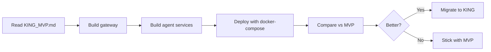

# AI Ecosystem - Deployment Guide

**Last Updated:** 2025-12-01
**Status:** Phase 1 Complete, MVP Ready for Deployment

---

## 🎯 Quick Start

### Option 1: Deploy MVP NOW (Recommended)
```bash
# Read this first
cat CLAUDE_MVP.md

# Follow migration plan
cat MIGRATION_PLAN.md

# Deploy in 2 hours
cd mvp && gcloud run deploy
```

### Option 2: Experiment with Microservices (Optional)
```bash
# Read architecture
cat KING_MVP.md

# Build in parallel to MVP
cd king && docker-compose up
```

### Option 3: Continue Development (Full Platform)
```bash
# All Phase 1 work preserved here
cd future/backend
uvicorn orchestrator.main:app --reload
```

---

## 📚 Documentation Structure

### For Deployment
- **CLAUDE_MVP.md** - Minimal viable product (4 agents, 8 endpoints, 3 tables)
- **MIGRATION_PLAN.md** - Step-by-step deployment guide (~2 hours)
- **README_DEPLOYMENT.md** - This file

### For Architecture
- **KING_MVP.md** - Microservices architecture (thin orchestrator)
- **CLAUDE.md** - Full platform documentation (13 agents, 34 endpoints)

---

## 🏗️ Current State

### Phase 1: COMPLETE ✅
- ✅ 13 agents implemented
- ✅ Guardian, Validator, Audit ministers working
- ✅ Creation pipeline with correction loops
- ✅ 16 services fully functional
- ✅ 34 API endpoints operational
- ✅ 9 database migrations applied
- ✅ 25 minister tests (100% pass rate)

**All Phase 1 work:** `d:\ai-ecosystem\future/`

### MVP: READY FOR DEPLOYMENT ⏳
- ⏳ 4 core agents (subset)
- ⏳ 5 essential services
- ⏳ 8 critical endpoints
- ⏳ 3 database tables
- ⏳ Cloud Run optimized
- ⏳ <$55/month cost

**MVP location:** `d:\ai-ecosystem\mvp/` (to be created)

### KING: EXPERIMENTAL 🧪
- 🧪 Microservices architecture
- 🧪 Thin orchestrator gateway
- 🧪 Independent agent services
- 🧪 Better scalability
- 🧪 Higher complexity

**KING location:** `d:\ai-ecosystem\king/` (optional)

---

## 🚀 Deployment Paths

### Path A: Deploy MVP (FASTEST)
**Time:** 2 hours
**Cost:** <$55/month
**Complexity:** Low


**Best for:**
- Getting to production FAST
- Proving concept works
- Minimal operational overhead

### Path B: Experiment with KING (OPTIONAL)
**Time:** 4-6 hours
**Cost:** ~$100/month
**Complexity:** Medium-High



**Best for:**
- Long-term scalability
- Independent service scaling
- Learning microservices

### Path C: Continue Development (FULL PLATFORM)
**Time:** Ongoing
**Cost:** N/A (local dev)
**Complexity:** High


**Best for:**
- Adding advanced features
- Completing Phase 2
- Long-term evolution

---

## 📊 Feature Comparison

| Feature | MVP | KING | Future (Full) |
|---------|-----|------|---------------|
| **Agents** | 4 core | 4 core | 13 total |
| **Ministers** | None | Optional sidecars | 3 integrated |
| **Endpoints** | 8 essential | 8 essential | 34 complete |
| **Memory** | No | No | Yes (Mem0) |
| **RAG** | No | No | Yes |
| **DNA Mutation** | No | No | Yes |
| **Telegram** | No | No | Yes |
| **Evaluation** | No | No | Yes |
| **Deployment** | Cloud Run (1 service) | Docker (5 services) | Any |
| **Cost/month** | <$55 | ~$100 | Variable |
| **Complexity** | Low | Medium | High |
| **Time to Deploy** | 2 hours | 6 hours | N/A |

---

## 🎓 Recommended Approach

### Week 1: Deploy MVP
1. Read `CLAUDE_MVP.md` (15 min)
2. Follow `MIGRATION_PLAN.md` (2 hours)
3. Deploy to Cloud Run (working production)
4. Monitor for 48 hours
5. Verify costs <$55/month

### Week 2: Monitor & Learn
1. Watch Cloud Run logs
2. Test all 8 endpoints
3. Measure response times
4. Identify bottlenecks
5. Document issues

### Week 3: Decide Next Steps
**Option A:** MVP sufficient?
- Keep running MVP
- Add features incrementally from `future/`
- Deploy updates gradually

**Option B:** Need better scaling?
- Build `king/` in parallel
- Compare performance
- Migrate if proven better

**Option C:** Want advanced features?
- Copy from `future/` to `mvp/`
- Add memory system
- Add RAG system
- Add DNA mutation

---

## 📁 Directory Guide

```
d:\ai-ecosystem/
│
├── 📖 Documentation
│   ├── CLAUDE.md              # Full platform (13 agents, 34 endpoints)
│   ├── CLAUDE_MVP.md          # MVP subset (4 agents, 8 endpoints)
│   ├── KING_MVP.md            # Microservices architecture
│   ├── MIGRATION_PLAN.md      # Step-by-step deployment
│   └── README_DEPLOYMENT.md   # This file
│
├── 🔮 future/                 # Phase 1 Complete (PRESERVED)
│   ├── backend/orchestrator/  # All 13 agents + 16 services
│   ├── supabase/migrations/   # All 9 migrations
│   ├── tests/                 # Full test suite
│   ├── scripts/               # Utility scripts
│   └── docs/                  # Phase 1/2 documentation
│
├── 🚀 mvp/                    # Deployable MVP (TO BE CREATED)
│   ├── backend/
│   │   ├── agents/            # 4 core agents
│   │   ├── api/               # 8 endpoints
│   │   ├── services/          # 5 services
│   │   └── main.py
│   ├── supabase/
│   │   └── migrations/        # 1 migration (3 tables)
│   ├── Dockerfile             # Cloud Run optimized
│   └── .env.example
│
└── 🧪 king/                   # Microservices (OPTIONAL)
    ├── gateway/               # Thin orchestrator
    ├── services/              # 4 agent services
    │   ├── code-writer/
    │   ├── code-reviewer/
    │   ├── video-planner/
    │   └── script-writer/
    └── docker-compose.yml
```

---

## 🔑 Key Decisions

### ✅ What to Deploy First?
**Answer:** MVP
- Fastest to production
- Lowest cost
- Proven architecture
- Easy to operate

### ✅ When to Use KING?
**Answer:** Later, if needed
- MVP proves concept first
- Build KING in parallel
- Migrate only if beneficial
- Not required for success

### ✅ What Happens to Phase 1 Work?
**Answer:** 100% Preserved
- All in `future/` directory
- Nothing lost
- Available for gradual integration
- Full documentation maintained

---

## 💰 Cost Estimates

### MVP (Cloud Run + Supabase)
- **Cloud Run:** <$10/month (free tier likely)
- **Supabase:** $0-25/month (free tier → Pro)
- **Gemini API:** $5-20/month (usage-based)
- **Total:** <$55/month

### KING (Docker + Cloud Run)
- **Gateway:** ~$10/month
- **4 Agent Services:** ~$40/month (4 × $10)
- **Supabase:** $25/month
- **Gemini API:** $20/month
- **Total:** ~$95/month

### Future (Full Platform)
- **All Services:** $50-100/month
- **Mem0:** $20-50/month
- **RAG Storage:** $10-20/month
- **Telegram Bot:** $0 (free)
- **Total:** $80-170/month

---

## 🐛 Troubleshooting

### "I want to deploy NOW"
→ Read `CLAUDE_MVP.md`
→ Follow `MIGRATION_PLAN.md`
→ Deploy MVP in 2 hours

### "I need better scaling"
→ Read `KING_MVP.md`
→ Build in parallel to MVP
→ Compare before migrating

### "I want all features"
→ Work in `future/` directory
→ Add features to MVP incrementally
→ Deploy gradually

### "I broke something"
→ Everything preserved in `future/`
→ MVP is separate from `future/`
→ Nothing can be permanently lost

---

## 📞 Support

### Documentation
- **MVP:** `CLAUDE_MVP.md`
- **Microservices:** `KING_MVP.md`
- **Full Platform:** `CLAUDE.md`
- **Migration:** `MIGRATION_PLAN.md`

### Code Locations
- **Phase 1 Complete:** `future/`
- **MVP (pending):** `mvp/`
- **Microservices (optional):** `king/`

### Git History
- All commits preserved
- Phase 1 work in `future/`
- MVP changes in `mvp/`

---

## 🎯 Next Actions

### Today (2 hours)
1. ☐ Read `CLAUDE_MVP.md` (15 min)
2. ☐ Read `MIGRATION_PLAN.md` (15 min)
3. ☐ Execute Steps 1-8 (90 min)
4. ☐ Verify deployment (10 min)

### This Week
1. ☐ Monitor Cloud Run logs
2. ☐ Test all endpoints
3. ☐ Measure costs
4. ☐ Document learnings

### Next Week
1. ☐ Decide: Keep MVP, build KING, or enhance?
2. ☐ Plan feature additions
3. ☐ Setup monitoring
4. ☐ Prepare for production traffic

---

## 🏆 Success Metrics

### MVP Successful When:
- ✅ Deploys in <5 minutes
- ✅ All 8 endpoints work
- ✅ Agents execute correctly
- ✅ Costs <$55/month
- ✅ Uptime >99%

### KING Successful When:
- ✅ Scales better than MVP
- ✅ Easier to maintain
- ✅ Cost justified by benefits
- ✅ No regressions

### Future Integration Successful When:
- ✅ Features added without breaking MVP
- ✅ Incremental deployments work
- ✅ Rollback possible at any time
- ✅ Documentation updated

---

## 📝 Summary

**You have 3 options:**

1. **MVP** (Recommended) - Deploy in 2 hours, costs <$55/month
2. **KING** (Optional) - Experiment with microservices, costs ~$100/month
3. **Future** (Development) - Continue building, deploy later

**All Phase 1 work is preserved in `future/`.**
**Nothing can be lost.**
**Choose your path based on priority: speed (MVP) or scale (KING).**

---

**Start here:** Read `CLAUDE_MVP.md` → Follow `MIGRATION_PLAN.md` → Deploy!
