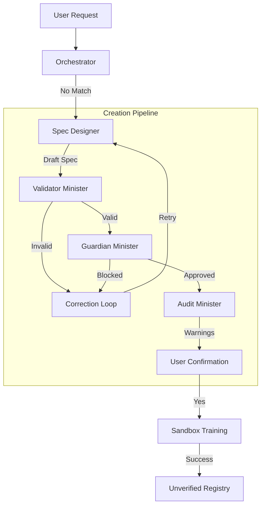

# Phase 2: Creation Workflow & Correction Loop

**Document Status:** DRAFT  
**Version:** 1.0  
**Date:** 2025-11-28  
**Author:** Product Strategist

---

## Overview

This document defines the flowchart for creating new specialists in the Kingdom. It introduces the **Automated Correction Loop**, ensuring that `spec_designer` works tirelessly to satisfy the Ministers before burdening the user or the admin.

---

## The Workflow

### 1. High-Level Flow



---

## 2. The Correction Loop Protocol

**Objective:** Minimize human intervention by having the AI fix its own mistakes.

**Max Retries:** 3 attempts.

**Process:**

1.  **Attempt 1:** `spec_designer` generates a draft spec based on user input.
2.  **Validation:** `validator_minister` checks structure/quality.
    *   *If Pass:* Proceed to Guardian.
    *   *If Fail:* Return error JSON to `spec_designer`.
3.  **Correction (Attempt 2):**
    *   `spec_designer` reads the error (e.g., "Purpose too short").
    *   `spec_designer` modifies the spec to address the specific error.
    *   Resubmit to `validator_minister`.
4.  **Security Check:** `guardian_minister` checks for danger.
    *   *If Pass:* Proceed to Auditor.
    *   *If Fail:* Return block reason to `spec_designer`.
5.  **Correction (Attempt 3):**
    *   `spec_designer` reads block reason (e.g., "Blocked: 'os.remove' detected").
    *   `spec_designer` rewrites DNA to achieve the goal safely (or removes the dangerous capability).
    *   Resubmit to Ministers.
6.  **Final Failure:**
    *   If validation/safety fails after 3 attempts, return a graceful error to the User: *"I could not design a safe agent for this request. Reason: [Last Error]."*

---

## 3. Data Structures

### Pipeline Context (State)

The `PipelineExecutor` will maintain this state during the creation process:

```json
{
  "user_request": "Create a file cleaner",
  "draft_spec": { ... },
  "validation_history": [
    {
      "attempt": 1,
      "minister": "validator",
      "verdict": "INVALID",
      "errors": ["Purpose < 20 chars"]
    }
  ],
  "retry_count": 1,
  "status": "IN_PROGRESS | COMPLETED | FAILED"
}
```

---

## 4. User Interaction Points

1.  **Clarification (Pre-Design):**
    *   If `spec_designer` enters `INTERVIEW` mode, the pipeline pauses and asks the user the question.
    
2.  **Confirmation (Post-Design):**
    *   Once the spec passes all ministers, the user is presented with a summary:
        *   **Role:** `file_cleaner`
        *   **Purpose:** `Safely archives old logs.`
        *   **Capabilities:** `Read logs`, `Archive to zip` (No delete allowed).
        *   **Auditor Warnings:** `None`.
    *   User inputs: `YES/NO`.

---

## 5. Implementation Strategy

*   **Orchestrator:** Manages the routing.
*   **PipelineExecutor:** Manages the loop and state.
*   **SpecDesigner:** The "worker" node that takes context and produces/edits JSON.

